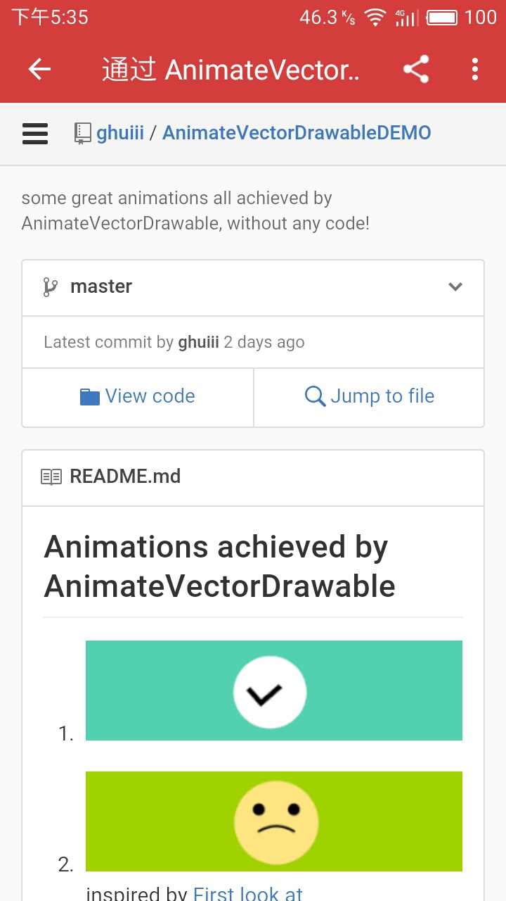

### Gank.io
a client for <a href="http://gank.io/">gank.io</a> with use dagger2+MVP+Rxjava</br>


项目采用dagger2+MVP模式编写

### Dev
- Android-Studio: 2.2 version
- Java version : Java8
- SDK Tool: 24.0.2 version
- jackOptions: true

### Points
- MVP
- dagger2
- rxjava,rxAndroid,rxlife,rxbinding,rxbus
- retrofit,okhhtp
- glide
- gson
- butterknife
- <a href="https://github.com/a1018875550/PermissionDispatcher">permissiondispatcher</a> (权限管理工具)


### Screenshot
<body bgcolor="#f0f0f0">
<p>
&nbsp;&nbsp;&nbsp;&nbsp;&nbsp;&nbsp;&nbsp;&nbsp;&nbsp;&nbsp;&nbsp;&nbsp;&nbsp;&nbsp;&nbsp;

</p>
<p bgcolor="#f0f0f0">
&nbsp;&nbsp;&nbsp;
</p>
</body>

### Download


[Download link ](http://download.fir.im/v2/app/install/5818acbcca87a836f50014af?download_token=a01301d7f6f8f4957643c3fcfe5ba6ff)


### Thanks
感谢<a href="https://github.com/HotBitmapGG">@hcc</a>的 <a href="https://github.com/HotBitmapGG/AndroidRank">AndroidRank</a>项目,让我学习了很多东西

### Some Links
- [Introduction use dagger2 ](https://guides.codepath.com/android/Dependency-Injection-with-Dagger-2#declare-your-singletons)
- [google mvp sample ](https://github.com/googlesamples/android-architecture)
- [Introduction to google mvp sample ](http://www.jianshu.com/p/01d3c014b0b1)


### Licence

```
Copyright 2016 JokAr

Licensed under the Apache License, Version 2.0 (the "License");
you may not use this file except in compliance with the License.
You may obtain a copy of the License at

   http://www.apache.org/licenses/LICENSE-2.0

Unless required by applicable law or agreed to in writing, software
distributed under the License is distributed on an "AS IS" BASIS,
WITHOUT WARRANTIES OR CONDITIONS OF ANY KIND, either express or implied.
See the License for the specific language governing permissions and
limitations under the License.
```